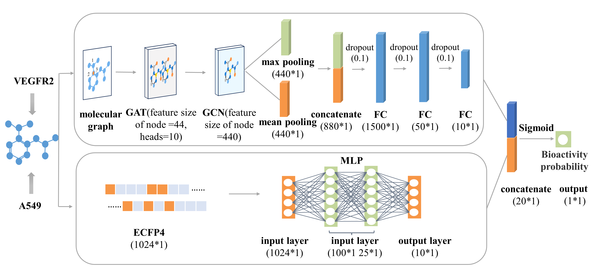

# FnGATGCN :Discovery of novel VEGFR2 inhibitors against non-small cell lung cancer based on fingerprint-enhanced graph attention convolutional network

This repository contains our implementation of [Discovery of novel VEGFR2 inhibitors against non-small cell lung cancer based on fingerprint-enhanced graph attention convolutional network](https://doi.org/10.1186/s12967-024-05893-2) (FnGATGCN). 

If you find this project useful, please cite our paper:

Wang ZX, Sun LL, Chang Yu, Xu Y, Huang J, Yang F, Chang Y. FnGATGCN :Discovery of novel VEGFR2 inhibitors against non-small cell lung cancer based on fingerprint-enhanced graph attention convolutional network. J Transl Med. 2024; 22(1): 1-16.

# Acknowledgements

We thank the authors of [Fingerprint-Enhanced Graph Attention Network (FinGAT) Model for Antibiotic Discovery](https://doi.org/10.1021/acs.jcim.3c00045) and [A unified GCNN model for predicting CYP450 inhibitors by using graph convolutional neural networks with attention mechanism](https://doi.org/10.1016/j.compbiomed.2022.106177) for releasing their codes. The code in this repository is based on their source code release ([link1](https://github.com/ExpectozJJ/FinGAT)) and ([link2](https://github.com/peggy-minyao/GCNN)). If you find this code useful, please consider citing their work.

# Data Collection

The data used for model training and evaluation are sourced from the [ChEMBL](https://www.ebi.ac.uk/chembl/) database. The database provides detailed information on chemical structures, biological activities, and associated targets. It offers a wealth of data on the interactions between small molecules and biological targets such as proteins, enzymes, and receptors. This information is crucial for understanding the mechanism of action of drugs and for developing new therapeutic agents. In the application scenario of this project, you can collect inhibitor data for target targets in the CHEMBL database. This will include compound IDs, SMILES, activity data, test methods, etc. In addition, in order to enrich the compounds in the negative dataset, you can adopt a certain sampling method to extract a certain number of compounds from the [PubChem](https://pubchem.ncbi.nlm.nih.gov/) database. Specific data collection and processing methods can be referred to in our published paper.

# Normalization

Deep learning models usually require a unified data input format to process molecular data. SMILES provides a standardized string representation, making it convenient for models to read and process a large amount of compound data. In this section, you need to further standardize the SMILES obtained from the [ChEMBL](https://www.ebi.ac.uk/chembl/) and [PubChem](https://pubchem.ncbi.nlm.nih.gov/) database.

To preprocess you datasets please go to `data processing` directory and run `Normalization.ipynb`.

It using the [MolVS](https://molvs.readthedocs.io/en/latest/index.html) tool, which included structure normalization, salt removal, charge neutralization, and duplicate molecule elimination. 

# Dataset Splitting

Before officially starting to train and evaluate the model, you need to divide the processed data into training set, test set and validation set according to a certain proportion. In this project, to mitigate the potential impact of data imbalance, we randomly split the dataset into training, validation, and test sets in a ratio of 8:1:1 ten times and calculate the average results.

To preprocess you datasets please go to `data processing` directory and run `Dataset Splitting.ipynb`.

# Model Training and Evaluation

To train and evaluate your model useing FnGATGCN, please go to `model` directory and run `FnGATGCN.ipynb`
